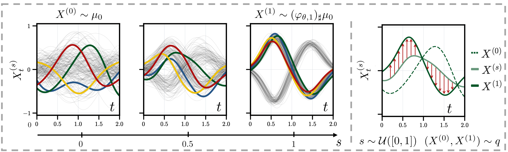

<h1 align="center">Universal Time Series Generation using Neural Controlled Differential Equations</h1>
<h2 align="center"><em>Flow Matching on Path Space with Maximally Expressive SLiCE Backbones</em></h2>

## Introduction

Generative Structured Linear Controlled Differential Equations (**G-SLiCEs**) are continuous-time generative models for time-series data. They use expressive **Structured Linear Controlled Differential Equation** (**SLiCE**) backbones and path-space flow matching to learn distributions over trajectories from simpler prior processes.


<p align="center">
  
</p>

**Highlights:**
- 🚀 Maximally expressive continuous-time generative modelling
- 🏆 State-of-the-art performance on GluonTS probabilistic forecasting benchmarks
- 🔄 Robust evaluation on arbitrary, shifted, and irregular observation grids

--- 

<details open><summary><b>Table of contents</b></summary>

- [Generative Structured Linear Controlled Differential Equations (G-SLiCEs)](#generative-structured-linear-controlled-differential-equations-g-slices)
  - [Linear NCDEs and SLiCEs](#linear-ncdes-and-slices)
  - [Path-Space Flow Matching](#path-space-flow-matching)
- [Using this repository](#using-this-repository)
- [Reproducing Experiments](#reproducing-experiments)
- [Environment Setup](#environment-setup)
- [Citation](#citation)
- [License](#license)
</details>

## Generative Structured Linear Controlled Differential Equations (G-SLiCEs)

### Linear NCDEs and SLiCEs

A linear neural controlled differential equation (LNCDE) takes the form
```math
h_t = h_{t_0} +
\int_{t_0}^{t}
\sum_{i=1}^{d_\omega}
A_\theta^i h_s\, \mathrm{d} \omega^{X,i}_s.
```
where $A_\theta^i \in \mathbb{R}^{d_h \times d_h}$ are state transition matrices, $X$ is the input time series and $\omega^{X}$ is a control path derived from $X$.

Structured Linear CDEs (**SLiCEs**) restrict the transition matrices $A_\theta^i$ to structured matrix families. Dense transitions are expressive but expensive. Diagonal transitions are efficient but not maximally expressive. SLiCEs use structured alternatives such as block-diagonal parameterisations that retain maximal expressivity while reducing computational cost. 

### Path-Space Flow Matching

The model defines a path-valued flow

```math
X^{(0)} \sim \mu,
\qquad
\frac{d}{ds} X^{(s)}
=
F_\theta\left(s, X^{(s)}\right),
\qquad
s \in [0,1],
```
where:

- $s$ is flow-matching time,
- $\mu$ is a prior law on paths and $X^{(0)}$ a sample,
- $F_\theta$ is a SLiCE network.

At inference time, the model samples $X^{(0)}$ from the prior and integrates the learned flow to obtain $X^{(1)}$, the generated trajectory. For conditional forecasting, the prior is a Gaussian-process posterior conditioned on the observed context window. For unconditional generation, the prior is an unfitted Gaussian process on path space.

## Using this repository


This repository provides the code to reproduce the experiments from the paper: **Universal Time Series Generation with Neural Controlled Differential Equations**

The main entry point for training is:
```bash
python bin/train.py \
    experiment={} \
    dataset={} \
    model=slice
```

Replace `experiment={}` and `dataset={}` with the corresponding configuration names. For example:

```bash
python bin/train.py \
    experiment=gluonts_base \
    dataset=gluonts/electricity_nips \
    model=slice
```

## Reproducing Experiments

Instructions for reproducing the main experiments are provided in: [REPRODUCE.md](./REPRODUCE.md)

## Environment Setup

The recommended Conda environment is defined in `environment.yml`. Create and activate the environment with:

```bash
conda env create -f environment.yml
conda activate cde-forecast-matching
python -m pip install -e .
python -m pip install --no-deps "torch-slices>=0.3,<0.4"
```

The environment is based on **PyTorch 2.6** and **CUDA 12.4**. The package `torch-slices` currently requires `torch>=2.8`. It is therefore installed with `--no-deps` to avoid pip upgrading Torch to CUDA 13 wheels, which require newer NVIDIA drivers. If your cluster requires a different PyTorch/CUDA runtime, adjust the PyTorch lines in `environment.yml` before creating the environment.


## Citation

If you use this work, please cite our preprint:
```bibtex
@misc{berndtfarjallah2026gslices,
  title        = {Universal Time Series Generation using Neural Controlled Differential Equations},
  author       = {Berndt, Torben and Farjallah, Elyes and Seute, Leif and Saqur, Raeid and Walker, Benjamin and Stühmer, Jan},
  year         = {2026},
  month        = {May},
  url          = {},
}
```

## License

The code in this repository is released under the MIT License. See [LICENSE](./LICENSE) for details.
The accompanying paper is licensed under [CC BY 4.0](https://creativecommons.org/licenses/by/4.0/).
